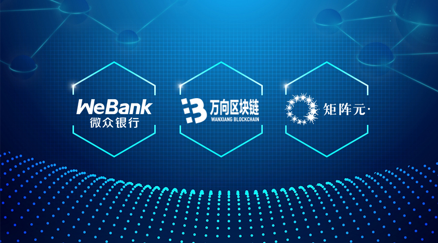
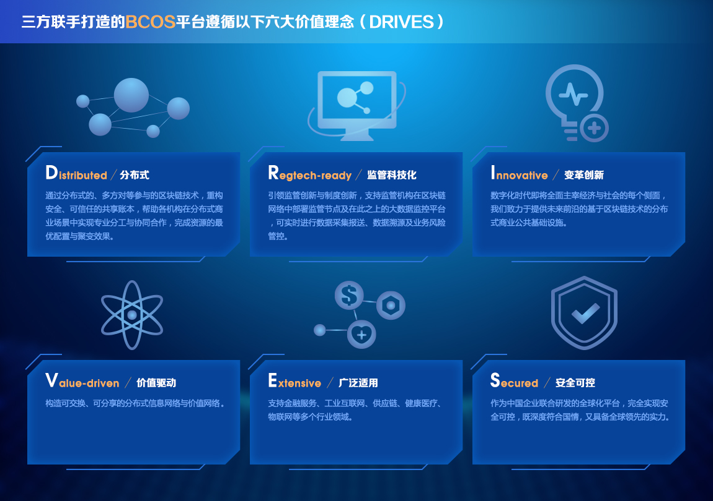
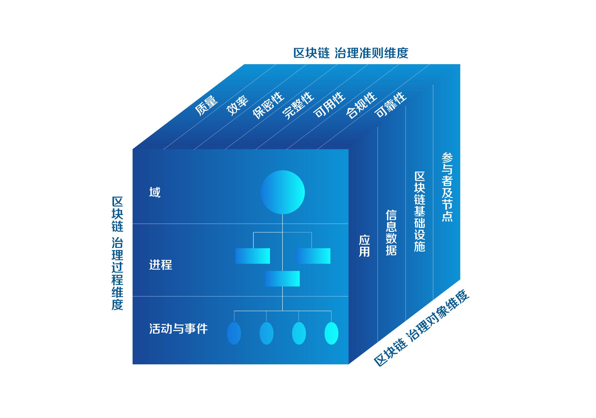
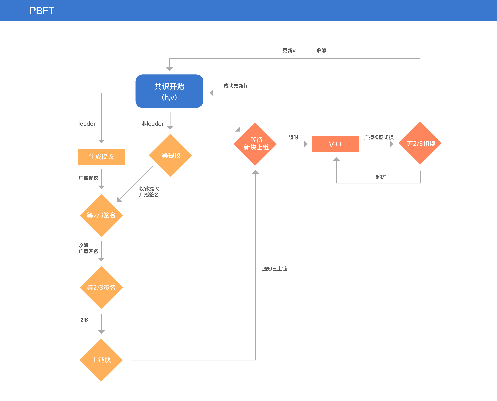
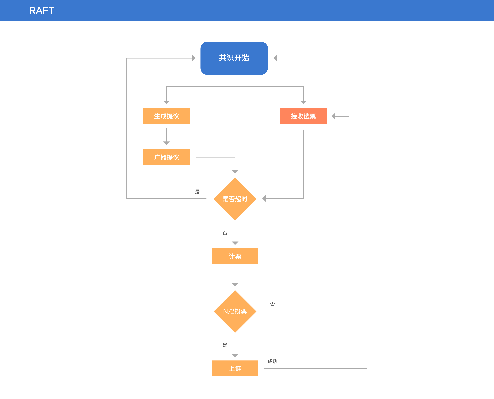
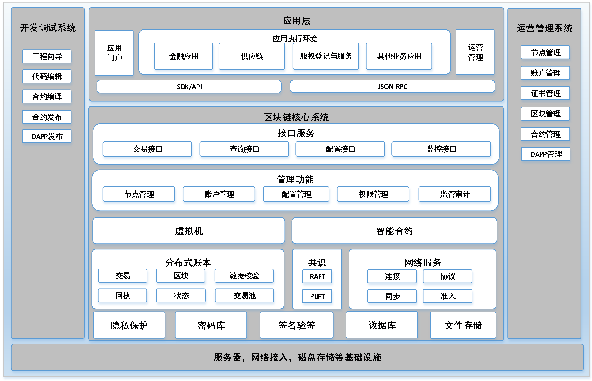
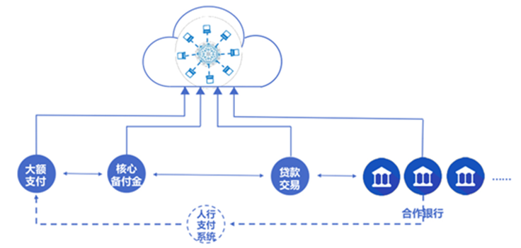
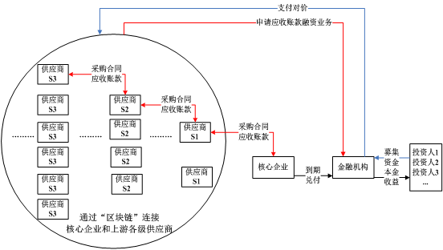
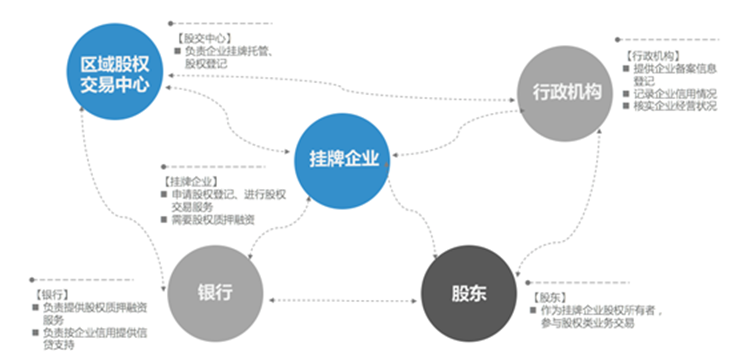

# 
BCOS平台白皮书

## 
面向分布式商业的区块链基础设施

### 
V1.0

### 
**Github**: Https://github.com/bcosorg/bcos

### 
2017年7月

<!-- TOC -->

## 目录
- [前言](#前言)
- [1 关于BCOS平台](#1-关于bcos平台)
    - [1.1 什么是BCOS平台](#11-什么是bcos平台)
    - [1.2 谁创建BCOS平台](#12-谁创建bcos平台)
    - [1.3 为什么开源](#13-为什么开源)
    - [1.4 核心理念](#14-核心理念)
    - [1.5 愿景](#15-愿景)
- [2 分布式商业与技术的融合](#2-分布式商业与技术的融合)
    - [2.1 分布式商业的定义与边界](#21-分布式商业的定义与边界)
    - [2.2 分布式技术的特性与价值](#22-分布式技术的特性与价值)
    - [2.3 分布式商业与技术的融合与演进](#23-分布式商业与技术的融合与演进)
    - [2.4规模化商用的挑战](#24规模化商用的挑战)
- [3. 区块链治理](#3-区块链治理)
    - [3.1 治理模式](#31-治理模式)
    - [3.2 区块链治理准则](#32-区块链治理准则)
    - [3.3 区块链治理对象](#33-区块链治理对象)
        - [3.3.1 身份认证与准入机制](#331-身份认证与准入机制)
        - [3.3.2 节点管理](#332-节点管理)
        - [3.3.3 共识机制](#333-共识机制)
        - [3.3.4 隐私保护](#334-隐私保护)
        - [3.3.5 监管和审计](#335-监管和审计)
            - [3.3.5.1 监管](#3351-监管)
            - [3.3.5.2 审计](#3352-审计)
    - [3.4 区块链治理过程](#34-区块链治理过程)
        - [3.4.1 交付和支持](#341-交付和支持)
        - [3.4.2 运维和监控](#342-运维和监控)
- [4. 开源平台技术特性](#4-开源平台技术特性)
    - [4.1 功能](#41-功能)
    - [4.2 性能](#42-性能)
    - [4.3 安全](#43-安全)
    - [4.4 治理](#44-治理)
- [5. 技术路线](#5-技术路线)
    - [5.1 多链和跨链](#51-多链和跨链)
    - [5.2 分布式存储](#52-分布式存储)
    - [5.3 隐私保护](#53-隐私保护)
    - [5.4 虚拟机优化](#54-虚拟机优化)
    - [5.5 可信信息管理](#55-可信信息管理)
- [6 BCOS平台的行业应用实践](#6-bcos平台的行业应用实践)
    - [6.1 联合贷款备付金管理及对账平台](#61-联合贷款备付金管理及对账平台)
    - [6.2 供应链金融服务平台](#62-供应链金融服务平台)
    - [6.3中小微企业股权登记与服务平台](#63中小微企业股权登记与服务平台)
- [7 未来展望](#7-未来展望)
- [参考文献](#参考文献)

<!-- /TOC -->

## 前言

随着全人类整体加速了向数字化世界的迁移进程，数据的采集与生产、存储与计算、分发与交换、分析与处理已经普遍存在于跨地域、跨领域、跨主体、跨账户的各种组织与企业之中。

在传统的中心化商业模式陷入“大而不能倒”（too big to fail）的窘境并引发金融危机之后，追求多方参与和对等合作的新型商业模式逐渐凸显价值。这种全新的模式我们称之为 **“分布式商业”**，其特点在于多方平等参与、智能协同、专业分工、价值分享等，已开始在不同的领域体现出一定的发展潜力。

相对应地，为了实现分布式商业的共享与透明规则，以开源为主要特征的分布式技术也得以发挥优势，致力于打破垄断的新型区块链技术如比特币、以太坊等渐渐步上历史舞台，成为了前沿科技的代表。不过，正如同每一次历史进程一样，这一进程也伴随着泡沫与杂音，初代区块链技术在性能、功能、安全、隐私、监管、法律等多个层面都存在欠缺之处，分布式商业的规模化发展需求正呼吁新一代区块链基础设施的诞生。

商业与技术的演进与变革由此拉开序幕，我们—— **深圳前海微众银行股份有限公司、上海万向区块链股份公司、矩阵元技术（深圳）有限公司**，历经几年的分别探索，在分布式商业的未来与区块链技术的发展方向达到了高度共识，经过一年的潜心开发与实践，选择将我们共同研发的区块链底层技术平台-BCOS平台完全开源，以此拥抱扑面而来的新时代。由于三家机构均是工信部牵头发起的 **中国区块链技术和产业发展论坛**的重要成员单位，BCOS平台在研发过程中，亦得到了 **工信部信软司和中国电子技术标准化研究院**专家们的指导和支持。

本白皮书是一次向分布式商业的展望、是一次对区块链技术的致敬，是对面向未来的分布式商业环境下的公共基础设施治理服务的全面阐释，并给出了用于企业级的区块链商用平台实现的描述。

## 1 关于BCOS平台

### 1.1 什么是BCOS平台

在面向分布式商业的长期演进过程中，BCOS平台（取BlockChain OpenSource涵义命名）作为第一阶段发布的开源技术平台，将为分布式商业提供完备的区块链技术基础设施及服务。

BCOS平台是聚焦于企业级应用服务的区块链技术平台，平台基于现有的区块链开源项目进行开发，综合考虑开源项目的成熟度、开发接口友好性、技术组件齐备性、可插件化程度、多样化复杂业务支持程度等多方面的表现，并根据企业级区块链系统的规范和需求，对开源项目从底层进行改造和升级，形成符合企业级应用场景功能、性能、安全性、监管等要求的技术平台，帮助各行业的用户来构建商用区块链服务。

### 1.2 谁创建BCOS平台

 **微众银行WeBank**—腾讯牵头发起设立的国内首家互联网银行，国内金融区块链领域的先行者和奠基者。

 **万向区块链Wanxiang Blockchain**—全球区块链生态的引领者和建设者。

 **矩阵元Juzix**—中国最大的区块链基础设施技术提供商。

图1-1 微众万向矩阵元三强联

2016年，三方在上海签署战略合作协议，成立区块链联合实验室，之后全面启动区块链及分布式账本技术的共同研发；2017年7月份正式启动全面开源计划。

### 1.3 为什么开源 

与基于单一信用背书实体的传统信任机制不同，区块链的信任机制是多个参与方对透明和可信规则的共同信任、是对客观信息技术的信任。因此，为了增加信任与充分透明，减少甚至完全剔除人的干预，区块链从诞生开始就是以开源技术的形式出现，大部分的区块链技术平台也皆以开源社区的形式存在。

开源的本质是共享技术，其商业意义在于：通过开源共享、推广技术标准打造出一个多方利益共同体。随着开源技术的普及和参与者数量的增加，该生态中的分工将更细，其影响范围也就越广，在与其他闭源的同类技术竞争的时候就越占优势。

简而言之，三家机构希望通过BCOS平台的开源，造就一个符合国情的、低接入门槛的、易于使用的、可规模化商用的企业级区块链开源底层平台，以便于满足各行业应对分布式商业涌现的需求，亦希望通过开源社区的建设，形成一个可持续发展的国际化技术生态圈。

### 1.4 核心理念
三方联手打造的BCOS平台遵循以下六大价值理念（DRIVES）：

图1-2 DRIVES价值理念

### 1.5 愿景
BCOS平台是我们迈出的第一步，我们将与金融、健康医疗、供应链、工业、物联网、能源服务等多个领域悉心耕耘的商业伙伴共同成长，聚焦于企业级应用，深刻洞察市场需求，积极进行技术更迭。

## 2 分布式商业与技术的融合
### 2.1 分布式商业的定义与边界
新一代分布式商业模式的兴起与涌现是社会结构、商业模式、技术架构演进的综合体现，参与者众多且分别拥有大量数据是这个时代日益凸显的基本特征，商业活动的发起与完成都需要引入更多参与方来协同操作。最终用户的需求将不再可能单一依赖于某个服务提供方，要求更多拥有垂直领域数据的参与方按照约定的方式、公开透明的提供服务。

分布式商业以多方参与、智能协同、专业分工、价值分享等为主要特征，典型的应用场景有银行联合贷款、银证信保的多方产品合作、N+N供应链金融、分布式能源、分布式电商以及各类共享经济等。

分布式商业提倡“专业分工”和“价值连接”：通过预先设定透明的价值交换或合作规则，使得分工及集群后的新商业模式产生强大力量，与传统单一中心化实体主导的商业模式相比有显著优越性。

### 2.2 分布式技术的特性与价值
为了实现分布式商业的对等、共享与透明规则，以开源为主要特征的分布式技术得以发挥优势，区块链技术、分布式账本技术等渐渐成为了前沿科技的核心代表。

一方面，技术架构变革导致分布式架构应用价值凸显。集中式的传统技术架构因其较高的投入、较差的弹性、对少数几家厂商过度依赖而面临发展瓶颈，技术上陷入“大而不能倒”的窘境，并难以实现对新型商业模式的有效支撑。

而在分布式商业模式下，参与各方具有平等地位，专注各自领域且足够成熟，在此基础上，采用基于对等架构的技术平台实时交换和共享数据，同时接入多家合作方，可以有效提升商业上的容错性，从而避免商业上的“大而不能倒”的情况发生。

另一方面，在安全可控成为国家战略的背景下,寻求区别于传统中心化架构的高性能、高扩展、高可靠且低成本的分布式架构，是新一代技术的必然选择。

因此，以区块链为代表的分布式账本技术的价值逐渐凸显。区块链技术是一种在对等网络环境下，通过透明和可信规则，构建不可伪造、不可篡改和可追溯的块链式数据结构，实现和管理可信数据的产生、存取和使用的模式。广义上，这是由分布式架构与分布式存储、块链式数据结构、点对点网络、共识算法、密码学算法、智能合约等多种信息技术共同组成的整体解决方案。

### 2.3 分布式商业与技术的融合与演进
区块链技术的应用最早从金融行业起步，并逐步向各个行业渗透。由于金融行业参与者群体广泛，而不同类型的金融机构其资质、资本、资源等禀赋各异、互补性较强，因此通常是以同业合作的对等形式共同设计产品或开展业务，如银银、银信、银保、证信合作等，天然形成了较多分布式商业场景的雏形，在某种程度上，分布式商业是传统金融同业合作模式的升华。

同时，健康医疗、物联网、工业互联网、能源服务、物流、供应链等多个领域也都存在类似需求与要求，这亦对区块链底层平台提出了较高的要求，为区块链技术与分布式商业的融合提供了演进的路线参考。

### 2.4 规模化商用的挑战
如需成功运用区块链技术，首先，需要改变传统的“中心化”商业模式的思维，走向专业分工、开放合作和价值共享，拥抱“分布式商业”这一新业务形态。其次，新的技术终究要在应用场景尤其是具备海量用户的企业级应用场景中被充分验证并推广，才能评判其成熟度。在过去几年里，区块链底层平台与应用虽然不断涌现，但大多数仍停留在实验室阶段以及小规模探索阶段，具体而言，区块链技术在中国进行大规模的商用仍然存在以下六点挑战。

- 政策可行性——是否与现有的技术监管、行业监管、技术治理、技术合规等要求符合，是否需要政策、法律、法规等的修改与支持；

- 性能可用性——是否满足大量用户、高并发量、快速响应时间、大量存储等的可用性要求；

- 业务适当性——是否能解决传统中心化技术难以解决业务痛点，带来新的分布式商业模式变革；

- 安全可控性——是否符合特殊行业的高安全级别要求，是否采取了各种必要的安全手段，保障链上资产和交易等信息的安全、可防范攻击等；

- 技术使用难度——是否通过规范开发语言、接口标准、友好平台等途径，降低应用难度，便于无技术积累的企业也能快速灵活加入使用；

- 治理难度——是否对区块链系统与传统系统的结合与互补有所考虑，是否规划设计了综合型系统的治理方法，对所有资源或对象进行统筹管理等。

基于对以上挑战的考虑，BCOS平台从中国的商业可行性与监管要求出发，对场景进行了深度理解，对平台进行深度定制，是更适合国内企业的联盟链解决方案；另一方面，我们本身就具有大规模的商用业务需求，对生产环境里能达到的并发用户数、访问量、吞吐量、响应时间、可用性、安全性等要求更高，因此从生产应用落地角度在联盟链的架构上也做了深度设计。
## 3. 区块链治理
### 3.1 治理模式

作为一个服务分布式商业的、广泛适用各个行业领域的区块链底层技术平台，BCOS平台或将面临功能模块不断增加、系统环节愈加复杂、交互的系统愈加广泛、参与对象逐渐增多、管理难度逐渐扩大等挑战，如缺乏科学的信息技术管理与治理观念，将无法实现可持续发展。因此，我们引进借鉴了国际上通用的信息技术系统治理标准--COBIT模型，将区块链的治理准则（Business Requirements）、区块链的治理对象（Resources），区块链的治理过程（Processes）综合考虑，形成一个三维的治理体系结构。目的是在商业风险、控制需求和技术问题之间架起了一座桥梁，以有效地利用资源，管理与区块链系统相关的风险，满足BCOS平台的大规模商用需求。

图3-1 区块链治理模型

区块链的治理准则维度集中反映了系统的战略目标，主要从质量、成本、时间、资源利用率、系统效率、保密性、完整性、可用性等方面来保证区块链系统的安全性、可靠性、有效性。

区块链的治理对象维度主要包括以参与者、共识机制、节点、应用系统、算法、底层设施及数据在内的区块链相关的资源。

区块链的治理过程维度则是在治理准则的指导下，对区块链的信息及相关资源进行规划与处理，从规划与组织、采集与实施、交付与支持、安全与监控等多个方面确定区块链的处理过程，并赋予每个处理过程详细的控制目标、审计方针及评估方法。

### 3.2 区块链治理准则

区块链技术需要按照各行业的商业与监管要求来设定核心治理架构，确保符合监管要求、符合国际标准、符合各行业基本规则。

具体而言，BCOS平台将遵循以下五大治理原则：

1） 合法合规原则：遵守国家相关法律法规和监管要求，为监管审计需求提供技术支持；  
2） 可追溯原则：业务与活动都有记录，可追溯，可审计；  
3） 安全原则：采取各种必要的安全手段，保障链上资产和交易等信息的安全，防范攻击；  
4） 隐私保护原则：保障链上的用户隐私安全，防止泄露用户隐私；  
5） 业务导向原则：以需求推动技术，设计与开发时优先考虑适用的业务场景，通常需要对原有业务流程进行重新梳理。一方面在保持合规性的同时要使区块链技术特性得以充分发挥，另一方面还须考虑如何为业务带来怎样的改善与价值创造。  

区块链技术的治理可深入至技术的核心环节如共识机制、节点准入、权限管理等，通常可划分为公有链、联盟链、私有链三种形式。BCOS平台综合考量后，选择了联盟链的部署架构与治理模式。

### 3.3 区块链治理对象

区块链的治理对象维包含参与者与技术系统的多个方面，内容广泛，以下将结合BCOS平台的设计重点与技术实现，选取部分具有典型区块链特色的治理对象进行阐述。

#### 3.3.1 身份认证与准入机制

BCOS平台的身份认证体系目前主要针对机构。在特定业务背景下，经个人用户授权后，由机构代理其个人用户在链上进行交易。

一个机构拥有一个到多个区块链节点，节点接入到联盟链的网络中，代表其所属机构在链上进行活动，包括同步数据、参与共识、发起交易等，机构和节点是一对多的关系，为了达成机构级别的安全控制和审计监管，首先需要对机构进行身份认证和准入控制。

目前，PKI（ Public Key Infrastructure ：公钥基础设施）是网络安全建设的基础与核心体系，通过第三方的可信任机构--认证中心CA(Certificate Authority)，把机构的公钥和机构的其他标识信息绑定在一起，可用于在网络上验证用户的身份。

BCOS平台支持的采用CA证书实现机构身份认证的机制与流程如下：

- 机构将自己的机构基本信息（名称，机构编号，联系方式等）以及所属节点的信息（IP地址，节点标识等），以及CA公钥证书提交给联盟链运营管理者，统一进行准入审核。

- 如机构准入审核被通过，联盟链运营管理员将该机构的节点信息，CA公钥证书向全联盟链广播，告知全部参与者，将新机构的新节点接入到网络，链上已活动的节点应允许新节点进行连接和进行握手。

- 在节点互相连接时，节点之间会采用CA证书里的私钥对自己的握手信息进行签名，发送给对方，接收方根据发送方的握手信息查询CA公钥证书，并使用公钥证书进行签名验证，以判断是哪个机构的节点发起的连接，是否允许继续通信。

- 证书管理服务会定期检测机构的证书状态，判定证书是否有效，如是否过期、被吊销等。如证书已经失效，则该机构的节点再尝试连接到网络时会被拒绝。

#### 3.3.2 节点管理
节点指安装了区块链软件的物理服务器或虚拟服务器，这些服务器可连接到联盟链网络，具有可访问的IP地址、能对外提供服务。   
从数据和共识参与程度来看，部分或全部节点可以设置为共识节点，参与共识算法，成为链上的记账者；不参与共识，只同步数据的节点称为观察节点。

节点的配置管理包括两个维度：全网配置管理及节点本地配置管理。

全网配置将参与网络的所有节点信息写入到链上共同维护的全局配置，在此配置里的节点才能被链上其他节点接受，不存在该配置里的节点或配置有误的节点，又或节点的CA证书已经过期，都会被拒绝连接，如此实现了联盟链节点的准入机制。全网维护的全量节点信息包含了节点的IP地址、端口等，也可用于节点之间的通信寻址。

本地配置是全网配置的一个子集，在本地配置文件里实现，支持黑白名单逻辑。

白名单用于解决节点快速发现的问题，白名单里的节点信息应被事先鉴定为权威的，可信的。做为一个新接入的节点，可以根据节点白名单，连接到已经被认为是可信的其他节点，进行数据同步，获取区块数据，全网配置等。当同步成功后，新接入的节点也拥有了和全网一致的全网配置，可以根据全网配置进行完整的连接控制，如包括CA认证等。

黑名单用于节点的自我保护，如出于安全、服务容量、网络可达性等原因，不能连接到某个其他节点，或者明确的不接受某个其他节点对自己的连接，则可以将该节点加入自己的黑名单配置，则这个节点对自己的连接将会被拒绝，自己也不会去连接这个节点，实现了通信层面的隔离。

本地配置只对拥有该配置的节点生效，不影响全网配置，可以是暂时性或永久性的，运维人员可根据节点的具体情况进行精细化控制，给节点的管理增加了更细粒度的控制能力。

#### 3.3.3 共识机制
共识机制不但是计算机之间的算法和数据共识，也是合作伙伴之间进行协作的共识，共识机制使区块链的参与者通过约定的方式进行共同记账，确保合作者之间的记账正确性、一致性、持续性，避免少数出现故障的节点影响网络运行，并防御少数故意作恶者的破坏。

公有链如比特币、以太坊等使用的共识算法通常为工作量证明或权益证明等，可以根据投入权益和记账的行为，对记账者制定奖励和惩罚制度。公有链上的共识算法一般确认时间较长，或需要较多的算力投入。

联盟链共识机制的设计目标和公有链有所不同，BCOS平台不会根据记账的计算量对记账者进行经济奖励，而是鼓励参与者在共同维护联盟链、促进生态系统发展、推进商业合作的过程中获得价值或收益。在此过程中产生的纠纷或非法行为，将采用监管审计和法律仲裁结合的方式解决。BCOS平台共识机制的实现符合联盟链场景需求，可避免算力浪费、防分叉和提升运行稳定性。

BCOS平台采用高效的PBFT、RAFT共识算法，采用插件化设计实现，通过修改系统配置，即可以在一个联盟链里使用不同的共识机制，参与到这个联盟链的所有节点必须采用同一种共识配置。

BCOS平台所使用的PBFT共识算法的特性包括：
- 共识节点轮流出块，具有同等的记账权，体现了参与者的对等性，且防止个别记账者作恶；
- 秒级出块，可配置为1秒到几秒出块，满足交易短时间内响应的需求；
- 支持1/3容错，整个系统中少于等于1/3数量的节点出现故障或作恶，均不影响共识进行；
- 在区块同步的过程中严格校验签名，保证数据的安全性。

PBFT共识具有高一致性、高可用性，抗欺诈能力较强，是联盟链里较为实用的一种共识算法，经过流程优化，也具有较高的效率。

图3-2 PBFT共识机制

BCOS平台所使用的RAFT共识算法特性包括：
- 共识节点达到出块条件，即把当前块作为候选区块发起选举，所有共识节点具有同等选票权重，体现了参与者的对等性；
- 候选区块超过半数赞成票才提交到区块链中，保证高一致性；
- 如果超时没有收集超过半数的回复票，则重新发起选举，保证系统的容错恢复能力；
- 秒级出块，可以配置为1秒或多秒出块；
- 支持1/2节点容错，整个系统中少于1/2数量的节点出现故障，均不影响共识进行；
- 在选举过程和区块同步过程中严格校验签名，保证数据的安全性。

图3-3 RAFT共识机制

RAFT共识具有较高的效率、高一致性和高可用性。与PBFT共识的拜占庭容错特性对比，RAFT共识并不严格保证抗欺诈性，适用于互信程度较高的联盟链。

联盟链的共识算法在节点总数不多、网络规模不太大时，可以提供较高的交易并发处理能力。但随着节点数量增多，比如达到几百个共识节点的规模时，由于需要共识节点之间交换较多的信息，会出现明显的性能下降。所以在联盟链中一般会通过协商，在保证公平公开的前提下，控制参与者共识的节点数量，以保证共识算法的效率。

BCOS平台的共识算法根据联盟链要求的身份对等性、交易响应时间、并发能力、以及服务器计算能力和网络带宽等进行深入优化，可提高计算效率，减少重复工作，降低带宽消耗。在保证高并发的同时，可保证交易在短时间内能得到确认，且一旦确认后，在联盟链里即达成共识且不可篡改。

#### 3.3.4 隐私保护

个人用户的KYC数据与机构用户的交易数据，都牵涉到隐私问题。目前对隐私保护的研究方向，包括使用密码学算法保护数据、在体系架构上引入可信第三方、以及按交易牵涉范围进行隔离等。

在密码学方面，零知识证明、同态加密等算法的研究进展给予隐私保护极大的想象空间，目前零知识证明和多操作的同态加密算法在实现上还存在数据量太大和计算速度较慢的问题，在其性能、可用性达到一定的要求后，可以在业务场景里进行探索性使用，如支持单一的加法或者乘法操作的同态算法在理论和工程上都已完备，可以针对部分场景使用。

在一些强监管或高安全要求的业务场景中，可以引进官方或权威的中央对手方提供信用背书，交易参与方的交易数据明细对中央对手方为全部可见，但对不相关的参与方为不可见，中央对手方负责对交易进行验证并提供面向全联盟链的可信证据。在这种业务场景里，通过物理隔离与通信层的逻辑通道设计，交易明细仅发送给交易牵涉的节点以及中央对手方，从基础层面防止了隐私数据的扩散。

BCOS平台出于对当前隐私控制需求的理解，以及从目前各种技术方案的发展现状出发，建议从以下方面实现隐私控制：

- 对数据的安全和敏感级别进行甄别，部分和交易以及账本无强相关，又具有高敏感性的数据，应脱敏后再发到区块链上或不发送到区块链上，如和某个机构签约的个人KYC数据，在未得到用户授权之前不应共享牵涉个人隐私的数据。数据脱敏从源头杜绝了隐私泄漏的可能性；
- 提供机构和机构之间点对点通信方式，数据通信仅发生在相关的机构之间，当机构之间针对交易数据完成校验和协商之后，仅把需要对全网确认共识的数据发送到联盟链上进行共享；
- 数据明细在链下保存，链上提供共识过的数据摘要、数据有效性证明、对数据的寻址方法、数据访问授权约定等，供机构之间在必要时通过数据下载协议获取可信的数据。分布式文件服务和存证类业务可以考虑采用类似方式，在链下保存图片、视频、其他类型的大文件，并将其摘要发送到链上获得有效性证明，这种方式可以同时解决数据容量和敏感性的问题。
- 数据可以对全联盟链进行广播，但采用高强度的加密数据信封方式进行保护，仅在交易参与方以及中央对手方、监管方之间共享数据，但未参与的的机构收到的是密文，且不能解密这份数据。
- 在部分只涉及到数据数值加减的场景，可采用加法同态加密算法，实现对数据的隐私保护，同时不会对性能有大的影响。
- 在部分能承受一定效率损耗, 并且涉及到复杂数据操作的交易场景，采用零知识证明，多操作同态加密等算法，用密码学方式实现隐私保护。

#### 3.3.5 监管和审计
##### 3.3.5.1 监管

随着区块链技术和业务形态探索的发展，需要在区块链技术平台上提供支持监管的功能，避免区块链系统游离于法律法规以及行业规则之外，成为洗钱、非法融资或犯罪交易的载体。

BCOS平台一方面提供可监管的数据接口，另一方面可支持监管部门作为特殊节点接入，可即时同步数据，并对数据完整性、有效性、过程和流程的合规性进行即时的监控，从而可对异常或违规行为及时处理或给予指导意见。各个参与方在加入时都需要经过准入流程提交真实资料，通过审核后才能加入。其真实身份和所用的操作帐号绑定并通过全链共识，在交易过程中，交易数据、共识过程也会附带自己的公钥和签名，通过签名数据验证，可以确定交易参与者的真实身份，参与者在链上的行为都会被记录且不可抵赖。

监管角色不同于开发者、交易管理员、联盟链运营者、运维者等，监管方可以拥有以上角色的权限的一部分或全部，也可以针对特定的业务场景，制定特定的权限集合。

例如，在一些特殊的强监管场景中，BCOS平台可支持监管方作为所有规则的制定者和实施者，通过参与准入审核，智能合约编写、部署和升级，以及事前中后的检测和干预对业务实施监管。其他参与者使用联盟链进行点对点的交易时，交易行为和规则都在受控范围内。

在另一些中度监管的场景中，BCOS平台可支持监管方选择性地参与到交易过程，如设计这样的一个智能合约：在合约执行前或者生效前，由监管方检查合约的规则、数据，必须符合监管要求，才给出签名背书。具有监管方签名且得到全链共识的交易才能生效。区块链上可永久保存与服务、资源、性能相关的数据和证据，监管方能在事后通过区块链数据同步的特性，审计所有的数据，进行业务合规检查、反洗钱等操作。BCOS平台预置了控制交易和部署合约的权限和接口，通过监管工具、角色赋权等方案，让监管方可以直接实施联盟链的控制。

##### 3.3.5.2 审计
审计功能主要用于满足区块链系统的审计内控、责任鉴定和事件追溯等要求，需要以有效的技术手段，配合业务所属的行业标准进行精确的审计管理。

BCOS平台在技术上允许审计者加入区块链系统作为其中一个节点进行实时监控与审计。区块链账本可永久保存与审计活动相关的数据和证据，包括协议所有参与方的活动、运营环境条件的记录和日志、审计员的审计查看动作记录等。建议在BCOS平台之外，仍需建立完善健全的审计制度。做到事后审计与事前、事中审计的有机结合，建立包含查处违规违纪审计、内控制度审计、绩效审计等维度的内审指标体系。

简而言之，结合区块链数据不可篡改、交易不可抵赖的技术特性，以及准入标准、智能合约、权限体系、监管和审计制度，可以实现对BCOS平台的有效监管和审计，保障业务运作的安全合规。

### 3.4 区块链治理过程
对具体的区块链事务流程，需要设计一系列的交付目标、相应的控制程序、以及评价执行效果的监控程序。

#### 3.4.1 交付和支持
使用BCOS平台构建应用的工作主要包括搭建联盟链、编写合约、开发客户端应用、以及运营管理和升级维护。
获得BCOS平台开源代码的用户可以对代码进行编译，输出二进制进程文件，部署到用户自己的服务器上，根据使用手册一步步地进行配置，组成独立的联盟链或加入已有的联盟链。

组链成功并运行之后，联盟链的管理运营工作应由参与到的全体机构共同进行，或者选举一个平台运营方来执行运营管理工作，如审批加入机构，分配交易帐号和设定权限，制定并执行业务管理规则，对运营情况进行统计分析等。

日常的支持工作应由运维人员负责，包括联盟链的参数配置，软件升级等。BCOS平台软件升级原则上保证向下兼容，原链上数据不会因升级而失效，且支持全网灰度升级，不要求所有节点同时升级或停机升级，可以按节点一一替换，运行新版本软件的节点和运行旧版本软件的节点可协同工作，直到旧版本被完全替换。

智能合约的设计应由参与到联盟链的多家机构，包括制定业务逻辑和监管规则的机构一起共同设计，给出全体达成一致的业务流程和约束条件说明，形成明确的智能合约需求。

开发人员根据需求，进行智能合约代码的编写、编译、单元测试。合约的开发可由多方协作进行，也可由联盟链的参与者共同委托一方或第三方开发，合约的代码需要在联盟链参与方之间开源。

测试人员对合约进行严格的功能和性能测试，测试结果公示给各参与方。

在合约通过测试并征得参与方一致同意之后，执行发布流程，发布到链上，经过共识机制确认，合约生效并被后续的交易调用。

BCOS平台上，合约可以升级，并通过灰度升级机制保证业务的安全升级，控制升级中可能出现故障时的影响面。新合约发布到链上后，可以通过灰度方式进行验证和逐步放量，如先使用测试数据进行验证，或将业务交易的流量按用户、商家、交易类型等维度分组，把交易逐步从旧合约切换到新合约上执行，待新合约逻辑验证通过，再全量切换到新合约，否则回退到上个版本的合约继续运行。

最后，BCOS平台提供了友好的SDK，在SDK基础上开发面向最终用户的、界面友好的、可交互的、功能丰富的客户端程序，以HTML/HTML5、PC或手机终端软件等多种形式呈现，在客户端上可以保存链上部分或全部的数据，也可以作为轻客户端访问链上节点。其中，轻客户端的安全策略与节点类似，将设置准入控制、身份认证及权限管理等。

#### 3.4.2 运维和监控
区块链系统从构建和运行逻辑上都具有较高一致性，不同节点的软硬件系统基本一致。其标准化特性给运维人员带来了便利，可使用通用的工具、运维策略和运维流程等对区块链系统进行构建、部署、配置、故障处理，从而降低运维成本以及提升效率。

运维人员对联盟链的操作会被权限系统控制，运维人员有修改系统配置、启停进程、查看运行日志、排查故障等权限，但不参与到业务交易中，也不能直接查看具有较高安全隐私等级的用户数据，交易数据。

系统运行过程中，可通过监控系统对各种运行指标进行监控，对系统的健康程度进行评估，当出现故障时发出告警通知，便于运维快速反应，进行处理。

监控的维度包括基础环境监控,如CPU占比、系统内存占比和增长、磁盘IO情况、网络连接数和流量等。

区块链系统监控包括如区块高度、交易量和虚拟机计算量，共识节点出块投票情况等。

接口监控包括如接口调用计数、接口调用耗时情况、接口调用成功率等。

监控数据可以通过日志或网络接口进行输出，便于和机构的现有的监控系统进行对接，复用机构的监控能力和既有的运维流程。运维人员收到告警后，采用联盟链提供的运维工具，查看系统信息、修改配置、启停进程、处理故障等。

## 4. 开源平台技术特性

不同于传统的中心化商业模式，分布式商业模式的发展需要由新一代数据交换基础设施承载。BCOS平台是专为大规模分布式商业设计开发的完整区块链技术平台，已经支撑了银行、股权市场和供应链的多个分布式商业场景。作为商用的新一代数据交换基础设施，BCOS平台当前版本已经具有了一些领先的技术特性。

图4-1 BCOS平台总体架构图

  
### 4.1 功能

具备完善的商业应用所需的功能和易用性，促进应用落地的实践。

* 支持灵活的用户帐户管理功能，采用角色和权限模型实现联盟链参与者管理
* 支持对全网所有节点同时进行灵活的配置修改，配置数据保持高一致性。
* 基于SDK、接口、智能合约，可快速的开发各种业务应用，将支持多种语言编写智能合约，使业务开发过程更符合企业级软件开发惯例。
* 支持分组多副本方式存储文件，并在区块链中保存文件的哈希值和相关寻址信息，提高区块链的存储和网络同步效率。

### 4.2 性能

具备较高的交易吞吐能力和低延时特性，可平行扩容，可支持海量服务。

* 对交易处理流程，通信流程进行优化，提升节点处理能力。
* 实现高效共识算法体系，采用插件式设计，支持经过优化的PBFT和RAFT共识算法。
* 具备并行计算架构，可平行扩容，满足海量服务需求。

### 4.3 安全

多层面，全面的安全防护，满足高要求的安全标准。

* 对通信层，用户数据等模块进行高强度的加密保护。
* 支持多种密码学算法，包括基于密码学的隐私保护算法。
* 提供安全方面的最佳实践，保障全网安全。

### 4.4 治理

具备规范的治理方式，保障业务合法合规，系统稳健运行

* 基于CA体系进行机构身份认证，具备节点准入控制机制。
* 提供监管审计的功能接口，支持监管审计接入
* 支持全面的区块链指标监控，保障运营质量
* 支持全网灰度升级，确保大规模商用网络的可维护性。

## 5. 技术路线

区块链领域的技术形态仍在快速发展中，BCOS平台开源平台将以下几个技术特性列为重点研究对象，一直在持续投入研究和开发。

### 5.1 多链和跨链

根据业务功能、隐私保护、数据隔离、或者性能容量扩展的需求，建立多个独立的链并行工作，链和链之间可以通过跨链服务进行交互，如发送交易，查询交易结果，读取配置数据等。

跨链交互目前是区块链领域的研究重点，在安全、防欺诈、数据一致性、效率等方面还需要进行深入探索。包括：
* 实现并行和跨链共识，提高共识效率；
* 用组合签名替代交易执行进行区块验证，减少交易执行次数；
* 跨链通信和数据校验、实现跨链安全交易，进行跨链对账。

### 5.2 分布式存储

现有区块链实现中，每个节点存储全量区块链数据，数据冗余度较高，且数据容量受单机存储硬件影响，在海量服务中，如需存储较长时间段的数据，其数据量一般不是单服务器能容纳的。

区块链数据一般采用文件型本地数据库如leveldb，在本节点的物理硬盘上基于文件系统保存，不提供跨网络的存储结构。而在对数据安全要求较高的机构里，数据一般存储在和外网隔离的安全区域里，以保障数据的安全。同时，这些机构已经建立了成熟的数据存储和维护方案，在基础架构层面保障数据存储服务的高可用、可扩容、可迁移、可维护，并和大数据平台等系统进行整合。

采用分布式数据存储的方案，可综合考虑数据的容量、可维护性、安全性，支持使用现有的企业级分布式存储解决方案，如数据仓库、数据库集群等存储区块链数据。

### 5.3 隐私保护

区块链技术虽然有一定匿名性，但收发地址和金额都是可追溯的，对于某些行业应用如金融类应用，显然缺乏隐私性。因此，BCOS平台考虑对以下数据进行周密的加密处理：

* 交易身份匿名：交易中对交易双（多）方地址进行完全匿名，满足一次一密、不可伪造、无关联性和可跟踪性。
* 交易数据加密：加密传输和存储交易数据。
* 账户状态加密：加密传输和存储账户状态数据。

对于以上加密数据，满足以下需求：

* 利益相关方（交易对手方、监管方）有权利看到明文数据
* 其他参与者没有权利看到明文数据，但其必须可以对密文数据的真实性进行验证

BCOS平台计划实现多层次的隐私保护：

* 身份匿名：使用群签名进行身份匿名，同时监管方可对用户身份进行跟踪。
* 数据隐私保护：已经在客户端和智能合约上实现加法同态加密算法，计划增加零知识证明用于证明加密数据的正确性（如账户余额数据是否足够用于支付）
* 细粒度的权限控制：基于属性加密算法和代理授权密码算法的多级访问控制，用于控制对加密数据的隐私访问。

### 5.4 虚拟机优化

BCOS平台计划在下一版本支持更高性能的虚拟机，支持更主流的开发语言。计划支持JVM虚拟机和Java开发语言。

### 5.5 可信信息管理

“预言机”解决方案让区块链的智能合约获取现实世界的不确定数据信息成为了一种可能，例如资产价格、货币汇率、股票指数等等。通过经济激励与博弈机制来让不确定的外部信息进入区块链智能合约，让智能合约的执行能够依赖现实世界的数据执行相关业务过程。

采用特定的共识机制对提交信息的确定性做出判断，让信息知晓者在经济利益驱动下基于区块链数字身份提交现实世界的数据信息，一定的惩罚机制也确保了信息会向着数据的确定性和正确性方向进行收敛。

## 6 BCOS平台的行业应用实践
### 6.1 联合贷款备付金管理及对账平台
2016年8月，微众银行联合上海华瑞银行，基于BCOS平台的早期版本推出了国内首个在生产环境中运行的银行间的联盟型区块链应用场景-联合贷款备付金管理及对账平台，通过区块链与分布式账本技术，优化联合贷款业务中的备付金管理及对账流程，实现了缩短对账周期、提高运营效率、降低运营成本等目标。

随后，洛阳银行、长沙银行也相继接入该平台，经历近一年的运行，该平台所记录的真实交易笔数已达数百万的量级水平。在真实生产数据的检验下，BCOS平台保持零故障运行，印证了其安全可控、业务可行、健壮可用的优点，其功能、性能、容错性、可靠性、安全性、保密性、可追溯、模块化、可维护性、可移植性、互操作性、数据一致性等特性亦被验证可达到高标准。

微众银行的核心产品“微粒贷”，是面向微信用户和手机QQ用户推出的纯线上个人小额信用循环消费贷款产品，采用同业合作及联合贷款模式向客户发放贷款，80%贷款资金由合作银行发放。该产品作为“分布式商业”的典型场景，非常适合采用区块链与分布式账本技术作为合作行之间的连接器，以提高中后台运营效率、提升流程自动化程度与降低经营成本等。

因此，微众银行在联盟链底层技术基础上，打造了联合贷款备付金管理及对账平台的应用场景，充分发挥区块链技术的不可篡改、互信共识、智能合约、可追溯与可审计等优势，把此前需要T+1的对账周期缩短到准实时，而且合作行之间通过此系统可以准实时查看备付金账户情况及对账结果等信息，进行实时头寸监控，免除依赖日终对账文件进行对账的繁重工作。

图6-1：以BCOS平台底层技术打造的联合贷款备付金管理及对账平台

除需进行基础设施资源申请、网络配置等运维支撑型工作外，合作行无需进行额外的系统开发工作，大大降低接入平台的技术门槛。在安全的考量上，微众银行的区块链网络和原有银行核心系统在逻辑层和物理层完全独立、互不影响，对数据的存储、传输、查看也采用了非对称加密算法进行加解密，确保数据全程安全运行，遵循银行业信息技术的强监管与高安全度的严格要求。

### 6.2 供应链金融服务平台
赊账销售这一现象在经济运行中愈加普遍，据国家统计局数据显示，2016年末我国规模以上工业企业应收账款12.6万亿元，各行业账期平均在90日左右，这其中蕴含着企业巨大的融资需求。而相比于巨大的应收账款，2015年我国年商业保理量仅在2000亿元左右。可以看出，还有大量融资需求没有被满足，因而供应链金融行业发展空间巨大。

今年上半年，上海万向区块链股份公司通过对汽车行业的调研发现，汽车行业的供应商资金在供应环节被大量占用，账期更长达5-11个月。同时，金融机构提供的应收账款融资业务对汽车行业供应商适用性有效。具体表现为：出于风控要求，商业银行在提供应收账款融资服务时，不仅要求供应商提供众多材料，通常还需要采购企业法人

协助确认该笔业务，而汽车行业上游供应商普遍较为弱势，并无法获得采购企业的支持；而一般保理商在提供融资服务时，手续相对简单，但资金成本平均12-14%，而汽车行业上游生产加工类供应商，利润率并无法覆盖该资金成本。

据此，上海万向区块链股份公司采用BCOS平台的底层技术开发了一个供应链金融服务平台，以优化应收账款融资流程。对供应商来说，该业务平台将有效缩短账期，降低融资成本，并保护购销过程敏感信息不被泄漏；对金融机构来说，该金融平台将有效杜绝虚假贸易，提高运营和风控效率。

图6-2：以BCOS平台底层技术打造的供应链金融服务平台

供应链金融业务非常适合采用区块链与分布式账本技术。首先，业务涉及多个主体，包括核心企业、供应商、金融机构、投资人等，通过区块链将交易信息在多主体间传递；其次，供应链上交易信息通常为商业敏感信息，区块链技术可实现数据加密；最后，通过区块链技术的数据不可篡改性和可追溯性，可有效杜绝供应链融资常见的虚假贸易现象。

总体来看，该平台针对信用评级高、融资成本低的核心企业，运用区块链技术将供应链交易信息进行链接，将信用从中心企业向末端供应商传递，以提高金融资源在供应链属企业间的配置效率。

### 6.3 中小微企业股权登记与服务平台
全方位扶持中小微企业快速成长，为具有增长潜力的公司提供优质的融资交易渠道，是区域股权交易中心的核心价值和服务重点。矩阵元正联合某区域股权交易中心，通过BCOS平台的底层技术打造服务于中小微企业的新一代股权登记与服务平台，从企业股权登记业务着手，通过新兴技术手段来重构企业信用基础，引导公共服务机构和商业机构共同参与，形成便利中小微企业交易融资的新型生态体系。

该股权登记平台可大幅提高区域股权交易中心业务处理的电子化程度，为企业及市场参与者提供方便快捷的业务受理窗口；通过智能合约优化传统操作流程及处理模式，实现业务办理与数据传递的流程化衔接，减少投资者临柜办理、纸质留档的麻烦。分布式账本技术不可篡改、多点信任的特点，可系统化的实现企业登记信息公示的可靠性，将登记及业务发起主导权交由企业或投资者自主负责，通过技术保障记录数据的真实性，规范股权登记业务在跨部门查询与审核上的可信度。

基于此，区块链技术为企业提供了一个更为全面、客观、可量化的信息披露与交易记录方式，并能以此为基础，在传统股权登记交易业务外，将区域股权交易中心引申为企业服务窗口，利用区块链技术信息互通、状态共享的特点，与各市场参与方、行政部门等机构形成数据安全共享生态，为企业提供可靠的信用画像，开辟低成本、高透明度的托管、质押、转让、融资等一站式金融服务平台，促进数字普惠金融的深入发展。

图6-3：以BCOS平台底层技术打造的股权登记与服务平台

## 7 未来展望

开源计划的生命力源于社区和无数开发者的伟大贡献。回归区块链技术的本质，其最初的目的是通过一系列公开公正、透明可信的规则，让系统实现在无人干预和管理的情况下正常运行，因此大部分区块链技术平台皆以开源社区的形式存在。其价值核心是在开放的精神下，以源码为核心，建立起规范的、长久的自治理制度，促进开发者持续有序地对源代码进行改善。

BCOS平台亦将秉承透明开放的开源理念，坚持开源方向，促进区块链技术的快速迭代与治理机制的完善，打造一个深度互信的多方合作共同体，进一步推动分布式商业生态系统的形成。BCOS平台将一如既往地遵循安全合规的发展路径，寻求同业与各级监管部门的支持，研究安全可控、高效可用的区块链核心技术，探索国际领先、适合国情的技术标准，加快区块链在各类分布式商业应用场景的落地。

## 参考文献

[1] ISACA 《COBIT 5: A Business Framework for the Governance and Management of Enterprise IT》

[2] 中国区块链技术和产业发展论坛 《中国区块链技术和应用发展白皮书》

[3] 中国区块链技术和产业发展论坛 《区块链参考架构》    
